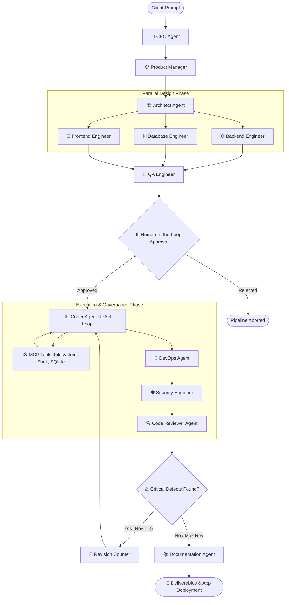

# 🚀 Engineers — Autonomous AI Software Engineering Organization

> An enterprise-grade, multi-agent AI software development organization built with **LangGraph**, **Gemini 2.5 Pro & Flash Multi-Model Intelligence**, **Model Context Protocol (MCP)**, **OpenTelemetry Observability**, and **Human-in-the-Loop Governance**.

---

## 📌 Executive Summary

**Engineers** converts high-level natural language prompt requests (e.g., *"Build me a food delivery application"*) into complete, production-ready software platforms. It orchestrates an entire software engineering organization consisting of **11 specialized AI Agents** working in parallel and sequential phases.

The system features:
- **Gemini Multi-Model Tier Specialization**: Fast `gemini-2.5-flash` for high-throughput planning, PRDs, & auditing + `gemini-2.5-pro` for deep Coder agent reasoning and code generation.
- **Parallel Fan-Out & Fan-In Architecture**: Concurrent execution of backend, database, and frontend engineering design.
- **Human-in-the-Loop (HITL) Checkpointing**: Pauses execution post-design with `AsyncSqliteSaver` persistent checkpointing before code execution.
- **MCP Tool Integration**: Equips Coder agents with direct file system, shell terminal, and database execution capabilities.
- **Automated Self-Correction Loop**: Code Reviewer evaluates code quality and routes back to the Coder for automated revisions if critical defects are detected.
- **Real-Time Observability Dashboard**: Tracks execution traces via OpenTelemetry / OpenInference standards hosted live on `http://localhost:6006`.

---

## 🏗️ System Architecture & Workflow



---

## 🤖 Specialized AI Agent Roster

| Agent | Module | Role & Key Output |
| :--- | :--- | :--- |
| **CEO Agent** | [`agents/ceo.py`](file:///c:/Users/swastik/Desktop/engineers/agents/ceo.py) | Defines high-level business goals, roadmaps, team composition, and scope. |
| **Product Manager** | [`agents/product_manager.py`](file:///c:/Users/swastik/Desktop/engineers/agents/product_manager.py) | Generates Product Requirement Documents (PRDs), user stories, and acceptance criteria. |
| **Architect Agent** | [`agents/architect.py`](file:///c:/Users/swastik/Desktop/engineers/agents/architect.py) | Designs system architecture, component topologies, technology stack, and data flows. |
| **Backend Engineer** | [`agents/backend.py`](file:///c:/Users/swastik/Desktop/engineers/agents/backend.py) | Produces REST API specifications, controller logic, authentication models, and endpoints. |
| **Database Engineer** | [`agents/database.py`](file:///c:/Users/swastik/Desktop/engineers/agents/database.py) | Formulates ER diagrams, relational schemas, SQL migrations, and indexing strategies. |
| **Frontend Engineer** | [`agents/frontend.py`](file:///c:/Users/swastik/Desktop/engineers/agents/frontend.py) | Specifies component hierarchies, design systems, UI routes, and client state management. |
| **QA Engineer** | [`agents/qa.py`](file:///c:/Users/swastik/Desktop/engineers/agents/qa.py) | Creates comprehensive test suites, unit/integration test cases, and edge-case criteria. |
| **Coder Agent** | [`agents/coder.py`](file:///c:/Users/swastik/Desktop/engineers/agents/coder.py) | Executes a ReAct loop with MCP tools to write clean codebase files and run compilation/test checks. |
| **DevOps Agent** | [`agents/devops.py`](file:///c:/Users/swastik/Desktop/engineers/agents/devops.py) | Configures Docker, `docker-compose.yml`, CI/CD pipelines, and environment configs. |
| **Security Engineer** | [`agents/security.py`](file:///c:/Users/swastik/Desktop/engineers/agents/security.py) | Audits code against OWASP Top 10, secret exposure, RBAC rules, and produces security reports. |
| **Code Reviewer** | [`agents/reviewer.py`](file:///c:/Users/swastik/Desktop/engineers/agents/reviewer.py) | Conducts static code analysis, performance evaluation, and triggers self-correction loops. |
| **Documentation Agent**| [`agents/documentation.py`](file:///c:/Users/swastik/Desktop/engineers/agents/documentation.py) | Compiles developer guides, user manuals, deployment instructions, and API reference docs. |

---

## 🔌 Model Context Protocol (MCP) Tools

The Coder Agent interacts directly with the local workspace through standard MCP servers loaded via `langchain-mcp-adapters` in [`mcps/combined_tools.py`](file:///c:/Users/swastik/Desktop/engineers/mcps/combined_tools.py):

- 📁 **Filesystem MCP** ([`mcps/filesystem.py`](file:///c:/Users/swastik/Desktop/engineers/mcps/filesystem.py)): File creation, directory management, safe path resolution (`@modelcontextprotocol/server-filesystem`).
- 💻 **Terminal / Shell MCP** ([`mcps/terminal.py`](file:///c:/Users/swastik/Desktop/engineers/mcps/terminal.py)): Automated command execution, dependency installation, pytest/compiler verification (`@mako10k/mcp-shell-server`).
- 🗄️ **Database MCP** ([`mcps/database.py`](file:///c:/Users/swastik/Desktop/engineers/mcps/database.py)): Direct SQLite schema verification and SQL query execution (`mcp-server-sqlite`).

---

## 📊 Observability & Telemetry Infrastructure

The project includes built-in OpenTelemetry & OpenInference tracing ([`observabillity.py`](file:///c:/Users/swastik/Desktop/engineers/observabillity.py)):
- **Silent File Exporter**: Logs trace spans to `./logs/telemetry.log` without cluttering command line output.
- **Live Telemetry Dashboard**: A lightweight built-in HTTP server ([`launch_dashboard.py`](file:///c:/Users/swastik/Desktop/engineers/launch_dashboard.py)) running on `http://localhost:6006` for inspecting real-time agent execution times, tool calls, and LLM payloads.

---

## 📁 Repository Directory Structure

```
engineers/
├── agents/                      # 11 Specialized AI Agent Implementations
│   ├── architect.py
│   ├── backend.py
│   ├── ceo.py
│   ├── coder.py                 # LangGraph ReAct agent with tool binding
│   ├── combined_agents.py
│   ├── database.py
│   ├── devops.py
│   ├── documentation.py
│   ├── frontend.py
│   ├── product_manager.py
│   ├── qa.py
│   ├── reviewer.py
│   └── security.py
├── mcps/                        # Model Context Protocol Configurations
│   ├── browser.py
│   ├── combined_tools.py        # MCP Client loader & LLM tool binding
│   ├── database.py
│   ├── docker.py
│   ├── figma.py
│   ├── filesystem.py
│   ├── github.py
│   ├── slack.py
│   └── terminal.py
├── test_project/                # Target Workspace for Generated Applications
│   └── gourmetgo-platform/      # Full-stack platform generated by agents
├── logs/                        # OpenTelemetry Log Store
│   └── telemetry.log
├── main.py                      # Baseline Sequential Execution Graph
├── main_v2.py                   # Production Graph: Parallel, HITL, Self-Correction
├── observabillity.py            # OpenTelemetry & OpenInference Instrumentor
├── launch_dashboard.py          # Observability Dashboard Server (Port 6006)
├── launch_app.py                # Automated Web App Discovery & Dev Server Launcher
├── pyproject.toml               # Project Metadata & Dependency Locks
└── README.md                    # Project Documentation
```

---

## 🚀 Quick Start Guide

### 1. Prerequisites
- **Python**: `==3.11.*` (Managed via `uv` or standard Python 3.11)
- **Node.js**: `>=18.0.0` (Required for running `npx` MCP servers and frontend web apps)
- **Gemini API Key**: Google Gemini API key configured in `.env`

### 2. Environment Configuration
Create a `.env` file in the root directory:
```env
GEMINI_API_KEY=your_gemini_api_key_here
```

### 3. Run the Production Agent Organization
Launch the complete parallel agent workflow with HITL approval, self-correction, and persistent SQLite checkpointing:
```bash
uv run main_v2.py
```
> 💡 **Human-in-the-Loop Interaction**: The pipeline will pause after generating product requirements, system architecture, database design, backend/frontend designs, and QA specs. State is saved to `logs/checkpoints.sqlite` so you can review specs, exit, or resume anytime! Press `y` when prompted to approve code generation.

---

## 🛠️ Utility Scripts

### 📊 Launch Token & Cost Analytics Observability Dashboard
View real-time token counts, estimated Gemini API costs, OTEL trace streams, and agent metrics:
```bash
uv run launch_dashboard.py
```
*Opens automatically at `http://localhost:6006`*

### 🐙 Auto-Publish Code to GitHub
Initialize local Git repository, commit generated files, and create/push to GitHub automatically:
```bash
uv run scripts/devops_github.py
```

### 🌐 Launch Generated Web Application
Automatically installs dependencies and launches the dev server for generated frontend apps:
```bash
uv run launch_app.py
```
*Discovers applications in `test_project/` and opens at `http://localhost:5173`*

---

## 🔬 Key Architectural Concepts Implemented

1. **State Graph Orchestration**: Built using `langgraph.graph.StateGraph` with custom `PipelineState` dictionary passing immutable state down the node DAG.
2. **Parallel Fan-Out / Fan-In**: Architect node fans out to `backend_engineer`, `database_engineer`, and `frontend_engineer` simultaneously. Results are joined seamlessly into `qa_engineer`.
3. **Conditional Edge Self-Correction**: Custom router function `should_revise_code` evaluates reviewer feedback severity. High/Critical issues trigger an automatic return edge to `coder` node up to 2 revision loops.
4. **Memory Saver Checkpoints**: `MemorySaver` checkpointer allows pausing execution before `coder` (`interrupt_before=["coder"]`), providing state inspection and safe manual resume.

---

## 📄 License

This project is open-source software under the MIT License.
